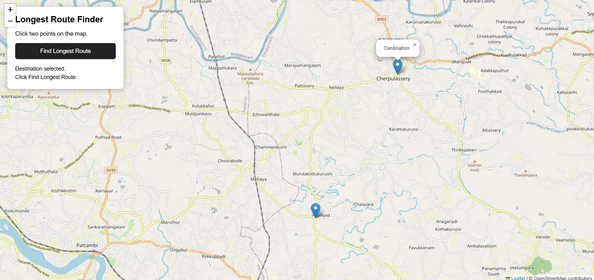
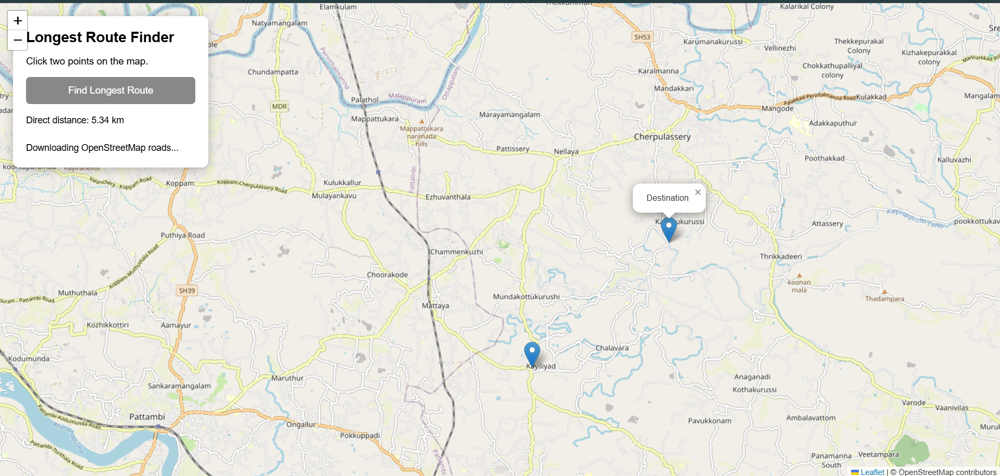
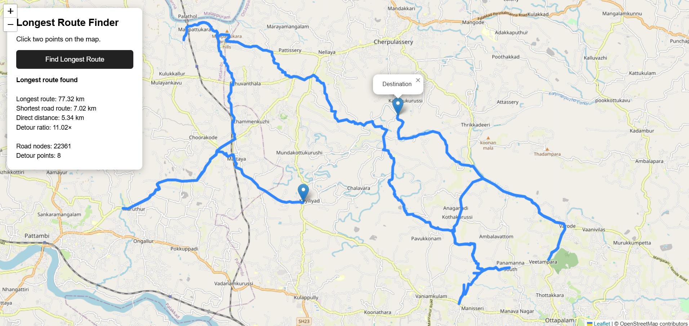
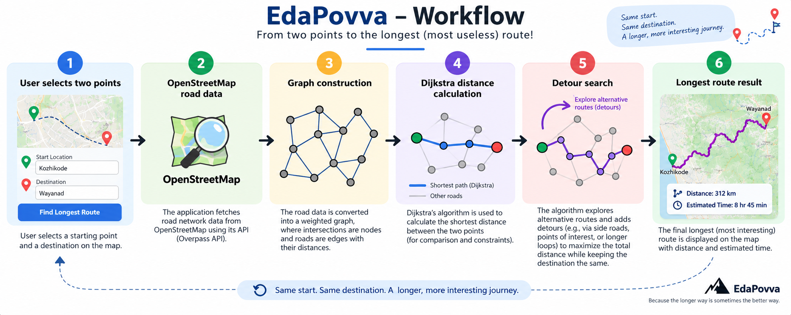

  

# EdaPovva

## Basic Details

### Team Name: DIJIKISTRA

### Team Members

-   Team Lead: Amjad Khan MP - IETCU
-   Member 2: Adithyan S - IETCU

### Project Description

Longest Route Finder is a simple web application that uses OpenStreetMap
road-network data to find a maximum-distance route between two points
selected on a map. It builds a road graph and uses Dijkstra's algorithm
to calculate and search for long detours.

### The Problem (that doesn't exist)

Why should two places be connected by the shortest route when you can
waste a perfectly good amount of time taking the longest possible way
there?

### The Solution (that nobody asked for)

Select a start point and a destination on the map, and the application
searches the OpenStreetMap road network for a long detour between them.
Instead of helping you reach your destination quickly, it deliberately
finds a much longer way to get there.

## Technical Details

### Technologies/Components Used

For Software: - HTML, CSS, JavaScript - OpenStreetMap - Leaflet.js -
Overpass API - Dijkstra's shortest-path algorithm - Visual Studio Code -
Live Server

For Hardware: - Not applicable - Not applicable - Not applicable

### Implementation

For Software: \# Installation 1. Download or clone the project files. 2.
Open the project folder in Visual Studio Code. 3. Make sure
`index.html`, `style.css`, and `app.js` are in the same folder. 4.
Install/use the Live Server extension in Visual Studio Code.

# Run

1.  Open `index.html` with Live Server.
2.  Click one point on the map to select the start.
3.  Click another point to select the destination.
4.  Click **Find Longest Route**.
5.  Wait while the application downloads the OpenStreetMap road network
    and searches for the long detour.
6.  The selected route is displayed on the map.

### Project Documentation

For Software:

The application builds a graph from OpenStreetMap road data using real
OSM node IDs. Dijkstra's algorithm is run from the start and destination
to calculate road distances efficiently. Reachable road nodes are
evaluated as possible detour points, and the maximum-distance valid
route is reconstructed and displayed on the map.

# Screenshots (Add at least 3)

*Shows the OpenStreetMap interface with the start and destination points
selected.*

*Shows the application searching the road network for a long detour.*

*Shows the final long route drawn between the selected start and
destination.*

# Diagrams

*Workflow: User selects two points → OpenStreetMap road data → Graph
construction → Dijkstra distance calculation → Detour search → Longest
route displayed.*

## Team Contributions

-   Amjad Khan MP: Developer
-   Adithyan S: Tester

------------------------------------------------------------------------

Made with ❤️ at TinkerHub Useless Projects

